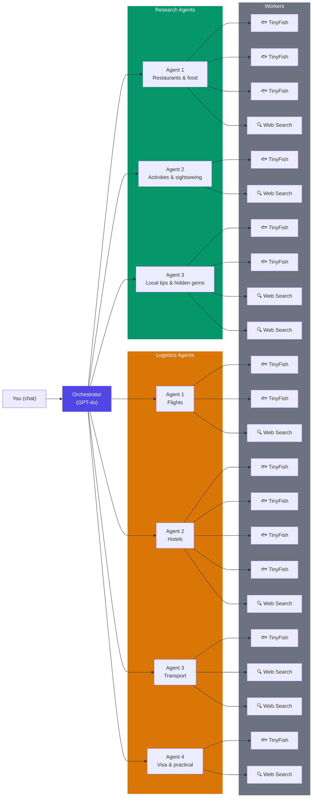
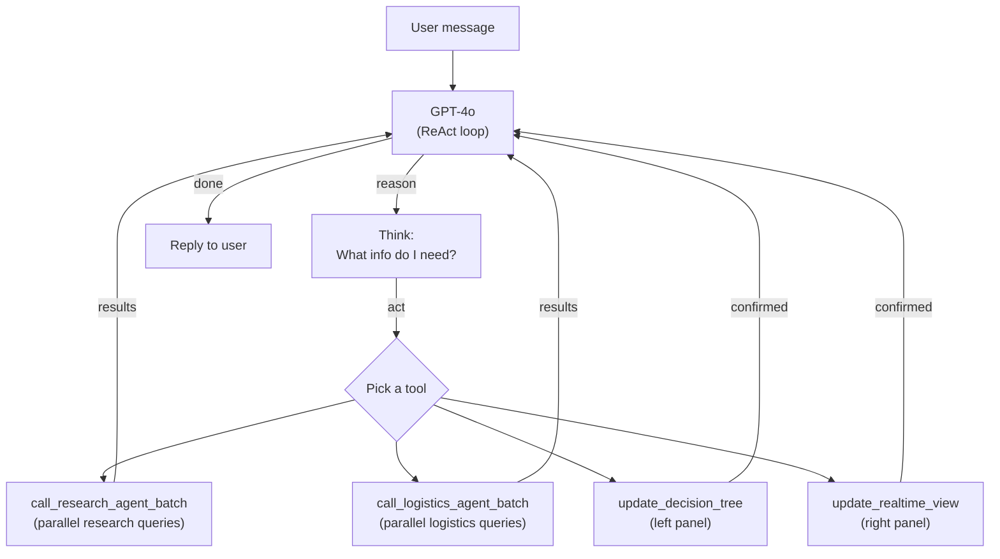
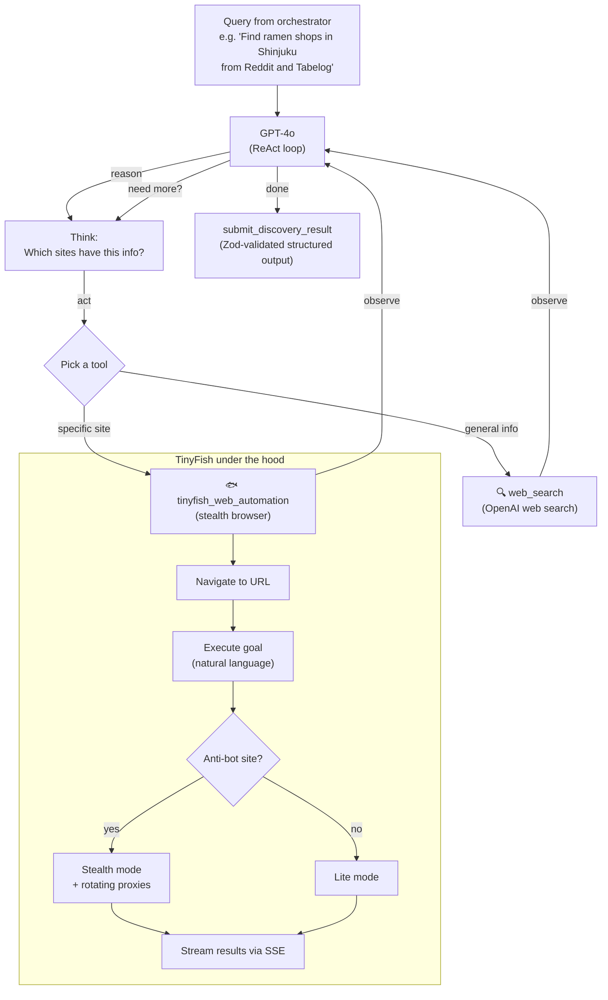

# Finding Nemo - Hackathon Demo Doc

## Problem

Few weeks ago, some of our friends had this conversation.


Planning a trip is **time-consuming and difficult**.

We research destinations, compare hotels, and build day-by-day itineraries. But even worse, there are a ton of **local tips and tricks we miss out on**.

We find the following problems:
- **Information Overload**: so many sources, so many opinions!
- **Accessibility**: Lots of reviews are in local communities, and it's very difficult to understand them.
- **Outdated Information**: Many reviews and blog posts are from years ago! You might visit a place, then find it closed.

Instead of spending hours, and relying on Google reviews or blog posts that might be years outdated, we can instead scrape **real-time data** from social media, Google Photos, and basically the entire internet.

## Solution

**Finding Nemo** is a travel planner that collects, organizes, and presents up-to-date information, and helps the user create a complete trip itinerary.

Users provide preferences, we do the rest. Users can just drill into any part and change it bit by bit.

## Core Principles

- **Information Overload**: we integrate and present all information to the user in an easy-to-understand manner.
- **Lazy-friendly**: minimize research effort for the user; the AI does the heavy lifting.
- **Complete, end-to-end orchestration**: from the idea to the entire itinerary, we plan together with you.

---

## Why Not Just Use ChatGPT?

There are already AI travel tools out there. Here's why they fall short:

| Tool | What it does | What it can't do |
|---|---|---|
| **ChatGPT / Gemini** | General chat, can suggest itineraries | No real-time prices. No scraping. Hallucinates restaurants that closed 2 years ago. |
| **Google Trips / Travel** | Flight + hotel search | No local community insights. No Xiaohongshu, no Reddit deep dives. Just ads. |
| **Wanderlog / TripIt** | Itinerary organizer | You still do all the research yourself. It just holds your bookmarks. |
| **Perplexity** | AI search with citations | Summarizes blog posts — still secondhand info. Can't scrape Booking.com for live prices or Tabelog for ratings. |

The core problem: **traditional AI tools can only search the open web.** They can't log into Booking.com and pull today's prices. They can't scrape Xiaohongshu for that viral ramen spot in Shibuya. They can't check if a hotel still has availability for your dates.

### vs. Layla AI — the closest competitor

  [Layla AI](https://laylaai.com) is probably the most polished AI travel planner out there. It has a great chat-based UX,
   generates day-by-day itineraries, and even shows hotels and flights. So why build Finding Nemo?

  #### Capability Comparison

  ```
                          Finding Nemo          Layla AI
  Real-time Data     ██████████████████░░ 9    ████████░░░░░░░░░░░░ 4
  Local Insights     ██████████████████░░ 9    ██████░░░░░░░░░░░░░░ 3
  Price Accuracy     ██████████████████░░ 9    ██████████░░░░░░░░░░ 5
  Anti-hallucination ████████████████░░░░ 8    ████████░░░░░░░░░░░░ 4
  Parallel Speed     ██████████████████░░ 9    ██████░░░░░░░░░░░░░░ 3
  Scraping Power     ████████████████████ 10   ██░░░░░░░░░░░░░░░░░░ 1

  🟦 Finding Nemo   🟧 Layla AI
  ```

| | **Layla AI** | **Finding Nemo** |
  |---|---|---|
  | **Data sources** | LLM knowledge + partner APIs | Real-time scraping of any website |
  | **Pricing** | Links to OTAs; prices can be stale | Live-scraped prices for your exact dates |
  | **Local knowledge** | Tourist-heavy "top 10" lists | Scrapes local communities (Xiaohongshu, Tabelog, Reddit) |
  | **Hallucination** | Suggests closed/non-existent venues | Cross-references real-time data |
  | **Alternatives** | Regenerating gives similar results | Drill into any decision, see 3-5 real options |
  | **Architecture** | Single LLM call, sequential | Multi-agent swarm running in parallel |
  | **Scraping** | No scraping capability | TinyFish stealth browser + rotating proxies |

  **TL;DR**: Layla AI is a smart chatbot that *knows about* travel. Finding Nemo is a **scraping swarm** that actually
  *goes and checks*. The difference is the same as asking a friend who's been to Tokyo vs. having 20 assistants
  simultaneously checking live prices, reading Japanese food blogs, and comparing hotel availability for your exact dates.

### Our edge: real-time scraping at scale

Finding Nemo doesn't just search — it **scrapes**. Using TinyFish's browser automation, we can:

- **Pull live prices** from Booking.com, Agoda, Google Flights, Skyscanner — sites that actively block bots
- **Read local communities** like Xiaohongshu (China), Tabelog (Japan), Naver Blog (Korea), Reddit — where the real tips live
- **Check real availability** for your exact dates, not cached results from last week
- **Bypass anti-bot detection** with stealth browsing and rotating proxies

This is the stuff you'd spend hours doing manually — opening 15 tabs, comparing prices, translating Xiaohongshu posts, cross-referencing Reddit threads. We do it all in parallel, in seconds.

---

## How It Works

### Step 1: Tell us what you want

You just chat. Tell us where you want to go, when, how much you want to spend, what kind of trip you're looking for. No forms, no dropdowns — just talk to it.

> "3-day trip to Australia, mid-range budget, love food and nature"

### Step 2: We build a high-level plan

Finding Nemo proposes a structure — which cities, how many days, how you get between them:

```
3-Day Australia Trip
  Day 1-2: Sydney
  Day 3: Blue Mountains (day trip)
```

You can tweak this before we go deeper. Don't like the order? Want to add a city? Just say so.

### Step 3: We fill in everything

This is where the magic happens. We dispatch **two AI agents in parallel**:

- A **Research Agent** scrapes community sources — Xiaohongshu, Reddit, TripAdvisor, Tabelog, Naver — for local tips, restaurant recommendations, hidden gems, and real sentiment.
- A **Logistics Agent** scrapes booking sites — Google Flights, Skyscanner, Booking.com, Agoda, airline sites — for real-time prices and availability.

You get a **complete itinerary** with one recommended option for everything:
- Flights with real prices
- Hotels with ratings and location reasoning
- Activities with day-by-day schedules
- Restaurants sourced from local community reviews
- A running budget breakdown

### Step 4: Drill down and revise

Click on anything in the plan to go deeper:
- **See alternatives** — click the hotel, see 3-5 other options with price/review comparisons
- **See why we picked it** — the AI explains its reasoning (reviews, proximity, price)
- **Swap it out** — pick a different hotel, and downstream suggestions (restaurants, transport) update automatically
- **Ask for changes** — "direct flights only", "cheaper options", "more food spots"

---

## The UI

Three panels, all connected in real-time:


### **Left: Decision Tree**:
- Shows your trip plan as a navigable tree.
- Get a top-level view: what is pending, in-progress, decided?
- And a budget tracker at the top, to track your spending.

### **Center: Chat**:
- You can talk to the orchestrator agent here.
- Asks you questions, presents and drives decisions.

### **Right: Live View**:
- Shows you, what are the agents doing right now?
- You can see flights, hotels, and other cards, everything you need to know with realtime data.


---

## Architecture

This isn't just one chatbot. An **Orchestrator** spawns copies of **research** and **logistics** subagents. Each of these subagents spawn Worker agents (TinyFish / OpenAI Web Search).




We use **ReAct agents** (Reason + Act) built with LangChain/LangGraph, that uses the OpenAI API under the hood.

Each agent reasons about what information it needs, picks the right tool, acts on it, observes the result, and repeats, just like what you would do, but at a scale impossible for humans.

Here, we discriminate websites. If the site is easy to scrape, we spawn an agent with the **OpenAI Web Search Tool**. Otherwise, we create a **TinyFish** agent, which gives each agent the ability to scrape real, difficult websites with bot protection.

### How the Orchestrator works

The orchestrator is the brain. It talks to the user, decides what needs to happen, and dispatches work to sub-agents — all through **DynamicStructuredTools** with Zod-validated schemas.



The key insight: the orchestrator doesn't just call one agent at a time. It **batches queries** — e.g. "find flights", "find hotels", and "find restaurants" all dispatch as parallel agent instances, each with their own ReAct loop.

### How each sub-agent works

Every research and logistics agent is itself a ReAct agent with two tools. It reasons about what sites to visit, scrapes them, and returns structured results — all validated by Zod schemas at every step.



The **DynamicStructuredTool** pattern is what makes this work at scale. Each tool has a Zod schema that tells the LLM exactly what inputs it needs and what outputs to expect. The orchestrator's tools accept complex nested objects (trip nodes, flight options, hotel options) — the LLM generates valid structured data on every call, no parsing or guessing required.


